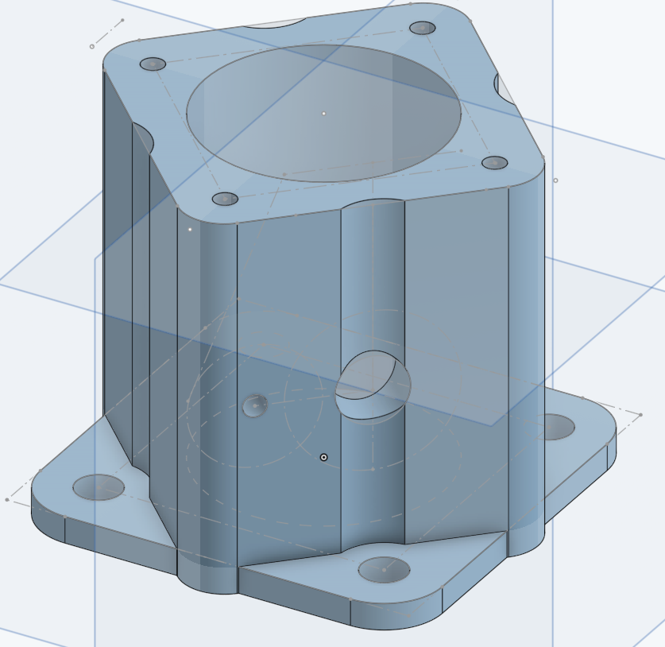
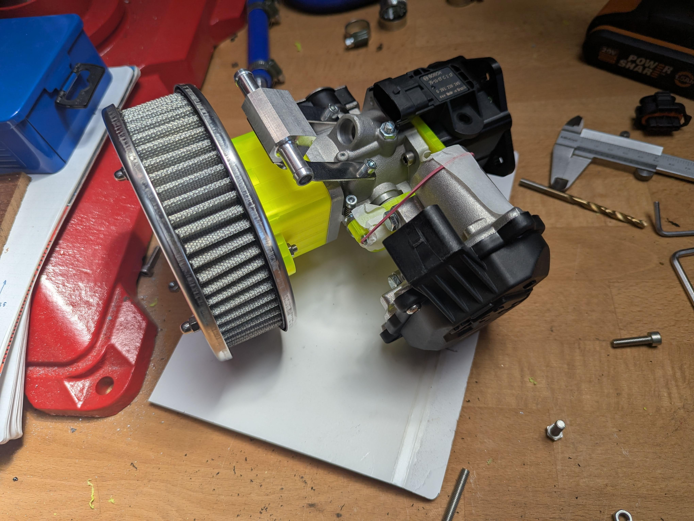
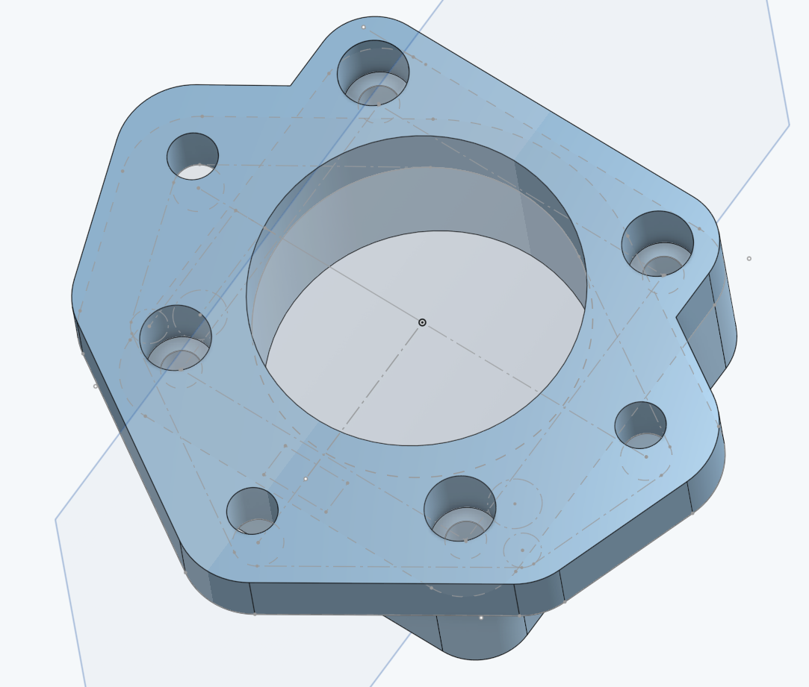
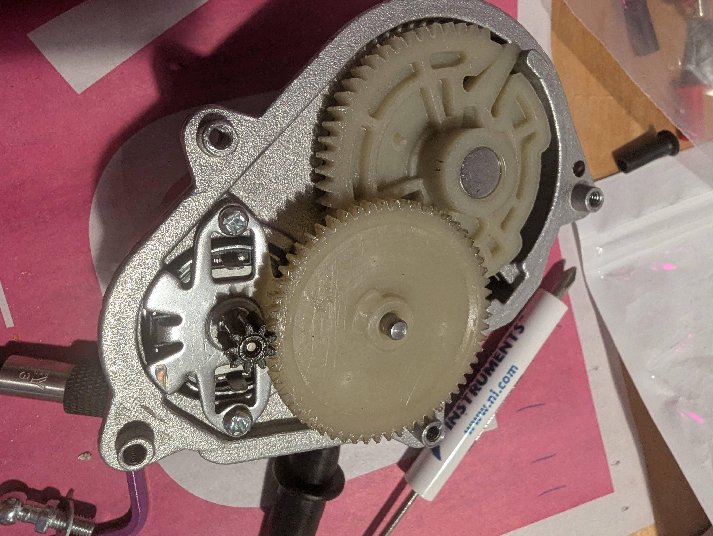
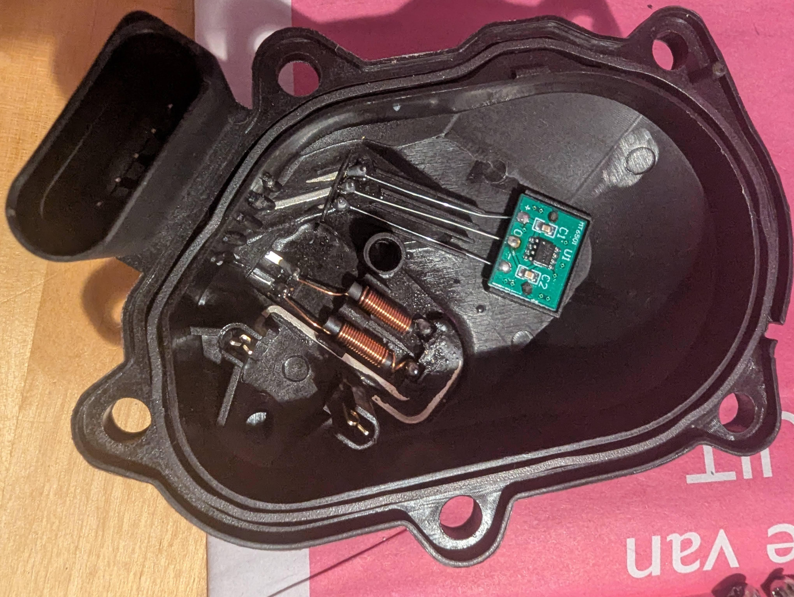
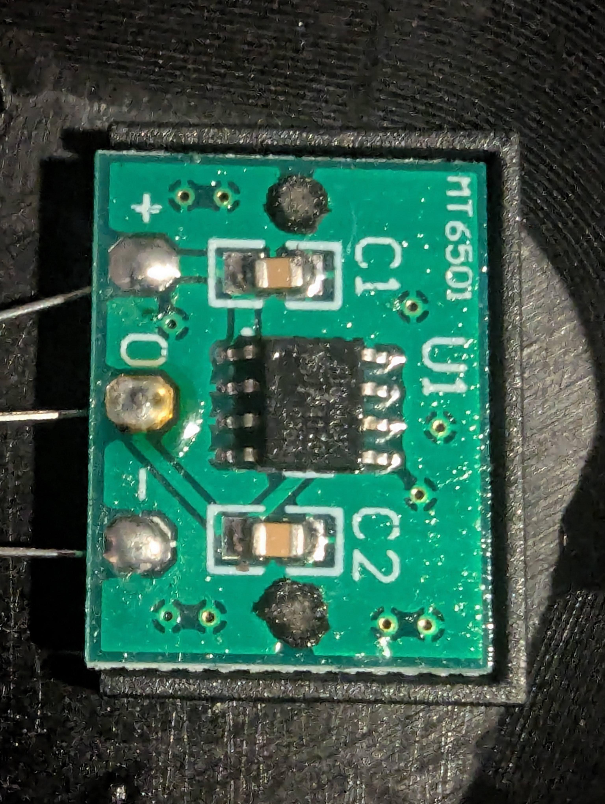
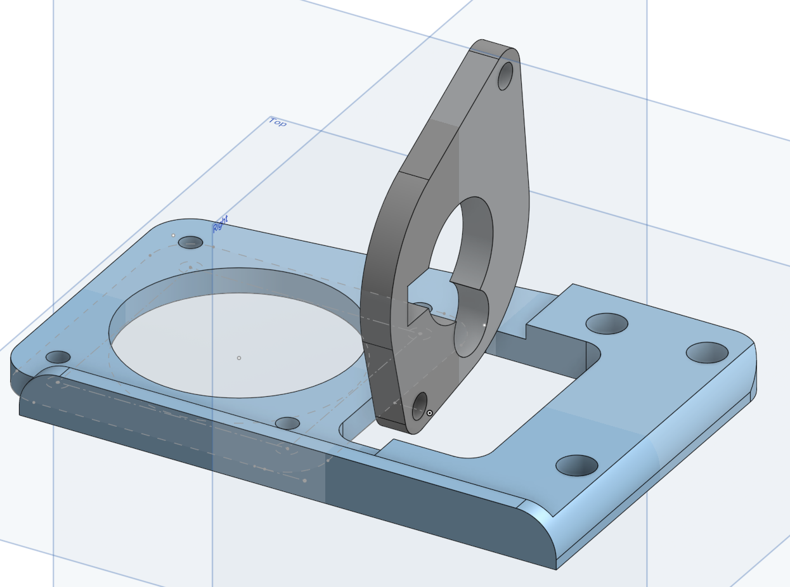
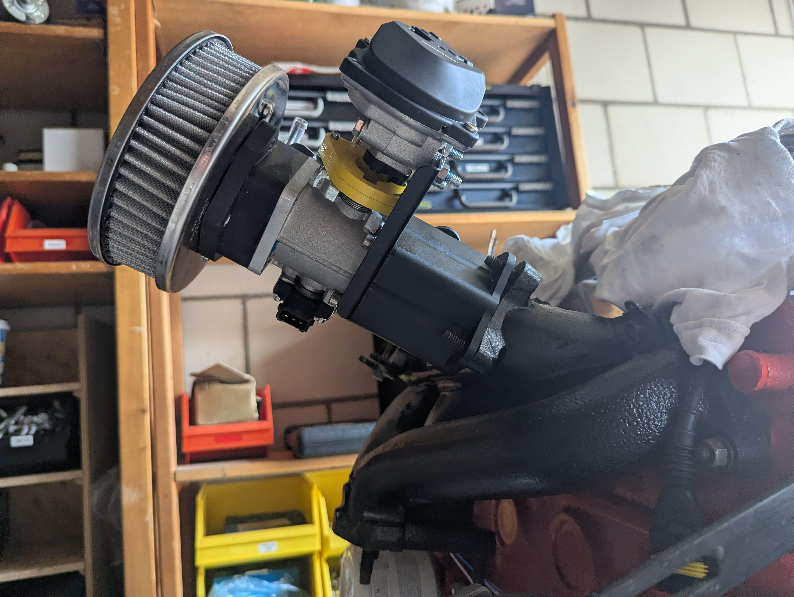
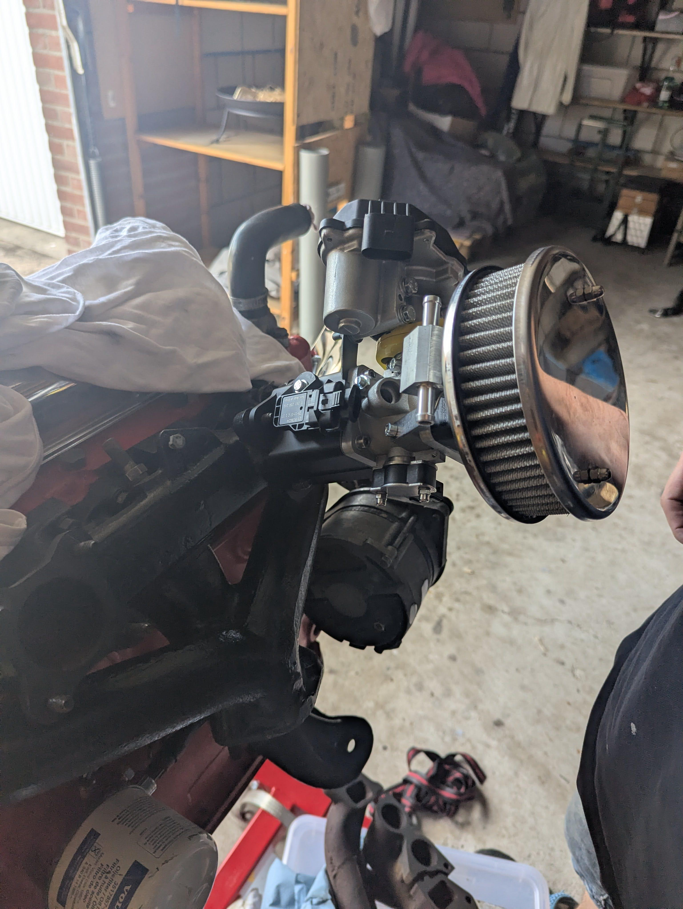

# Throttle body

## Inlet adapter 
I wanted a throttle body with an injector mount and, due to simplicity, a single throttle body.

On Aliexpress I found the SherryBerg SF INDIVIDUAL 45DCOE throttle body with injector hole.

This wouldn't fit on my inlet (single Stromberg) so I designed the throttle body adapter with MAP sensor that fits on the inlet.

The inlet studs interfere with the mounting holes of the throttle body, so (for ease of machining) I placed it on a 45° angle.

[Onshape drawing](https://cad.onshape.com/documents/0b7af1e6f760dcd227093215/w/633469c9a471f312de7ea68d/e/62977b88f0449c9958599a65?renderMode=0&uiState=6a8ca4a1e2d3cacf2793a244)

The original studs go thru the bottom holes (3/4"?), the MAP sensor mounts with an M5 bolt, throttle body with 4x M5 bolts.

The black 3d printed part underneath bosch sensor is the throttle body adapter:

## Air filter adapter

I wanted to put on an original air filter, because it would the also fit my LPG mixer and allow me to drive a bit cheaper (and tune my LPG setup with the WBO!).

There were no drawings of the Stromberg air filter bolt pattern, so after some measuring of the filter and gaskets, I came to the values in the drawing:
[Onshape drawing](https://cad.onshape.com/documents/abbd7bdb99987136078d0d69/w/03a156559242dee69cc3e9b2/e/de452c969dff44866444f485?renderMode=0&uiState=6a8ca6836bc19d8ae88aa95d)

This bolts with 4 sunken M5 screws onto the throttle body and 3 M8 bolts hold the filter in place:

## ETB actuator

The ETB actuator is an [AP01 New Intake Manifold Flap Actuator /Motor for Audi A3,A4,A5,A6,Q5,TT,VW,Seat 03L129086 03L129086V A2C59506246](https://nl.aliexpress.com/item/32885141286.html), with [1J0973705 8K0973705 connector](https://nl.aliexpress.com/item/1005009393592303.html) (TODO: Check if really this one or other order). 

While testing, it worked quite well. It has a angular magnet sensor (MagnTek MT6501) with a magnet on the output shaft:

To mount the actuator, I drew a sketch to mount it in-line with the throttle body axle with a small adapter plate to connect them together:

I had the main plate cut from 1.5mm stainless and bent the long edge, so I had to put 2 rings under the actuator to get to the correct height (3mm).

[OnShape drawing](https://cad.onshape.com/documents/ca783a9afe49f4a5da711b29/w/143d90f5453d7bba12735ea2/e/f7d11f3b575e5ab966e14a1a?renderMode=0&uiState=6a8cab61533a71d7ef48b54d)

The small part in between is 12mm thick plate to drive the valve axle. Had to grind down the adapter and drill out the holes. Used 2x sunken M6 bolts.
Had to break it in 2 as JLCCNC couldn't cut it from that thick.

The actuator springs back the correct way, together with the weak spring of the throttle body, the valve is closed when unpowered.

## TPS
To have a second TPS signal, I put on a Sherryberg tps sensor. The first one wouldn't fit correctly (offset), but luckily the other one fits.

## Final assembly

(wrong inlet, needed to put on a different inlet for 1 throttle body)

Needed to mount the injector, but rest of it is with gasket or liquid gasket ( LOCTITE 5926, not recommended for gasoline...).