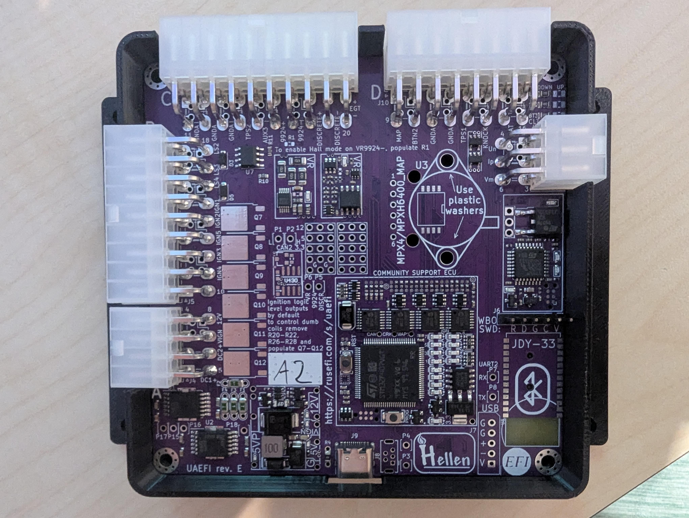

# Electronic Control Unit

After looking into Megasquirt, Speeduino and rusEFI, I chose to go for the last one. It is an open source ECU, hardware and software, active community and has the features I was looking for.

I chose the [UAEFI](https://github.com/rusefi/rusefi/wiki/uaEFI) as the production files are open source ([rusefi/uaefi](https://github.com/rusefi/uaefi), revision E) and it supports >4 cylinders (injectors and ignition), has an on-board wideband lambda controller and also supports drive by wire(DBW) throttle control. The last part is nice, because it removes the choke control (or stepper for it) and doesn't require me to mess with the linkages.

As the ECUs were already quite expensive(min order 5 pcs), I chose to make them pink:

Using the case from [Light-r4y/uaEFI_case](https://github.com/Light-r4y/uaEFI_case).

Currently only toyed with TunerStudio and tried some settings.

## Goal settings
- starter relay control (start stop button)
    - Don't know yet how start-stop control works in rusEFI
- Drive by wire
- fan control
- Injection based on throttle position or pressure sensor, whatever is easier and works better
- 4 independent ignition coils, sequential
- 1 (for now) injector
- Crank angle sensor, hall effect, 36-1 trigger wheel
- Single tooth cam angle sensor, hall effect, inside distributor

## TODO
- buy and solder some map sensors
