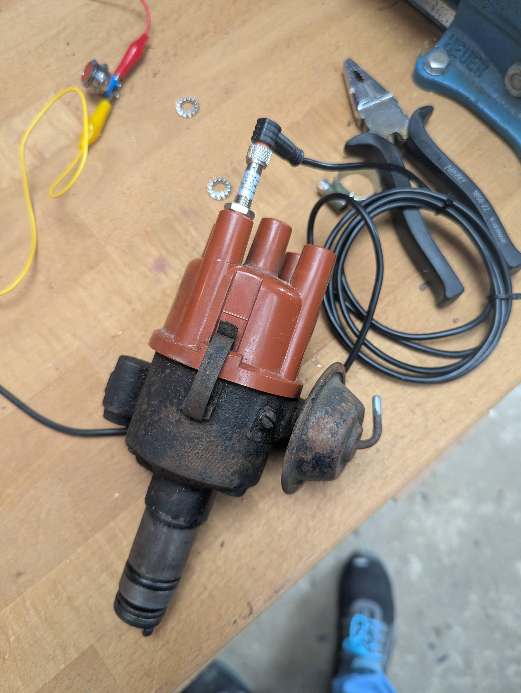
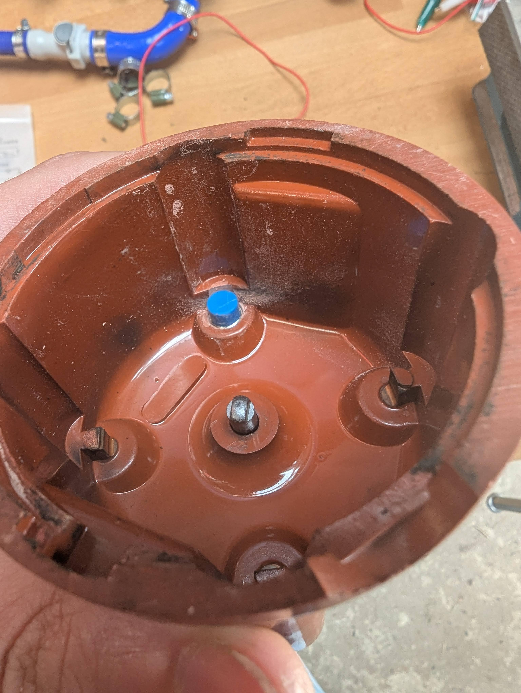

# Cam angle sensor

The crank angle sensor measures the RPM and timing, but the ECU doesn't know yet which phase each cylinder set is in. It can be that cyl 1 is compressing and 4 is in exhaust stroke, or the other way around. The cam angle sensor tells the ECU which phase the motor is in and allows for sequential ignition instead of batch.

For this I used a basic hall sensor, drilled a hole into the original distributor and glued it in.

The sensor is a cheap [hall sensor](https://nl.aliexpress.com/item/1005002571556707.html) (LLJ8A3-4 (4mm L), 2m line length, NPN NC) that works on 12V. The angle needs to be measured for the ECU.

## Tuning
The ECU probably needs to be set up in single tooth, and the angle needs to be configured.

Due to the sensor quality, I'll probably set the ECU to ignore the sensor after cranking, as it'll just keep track of it.