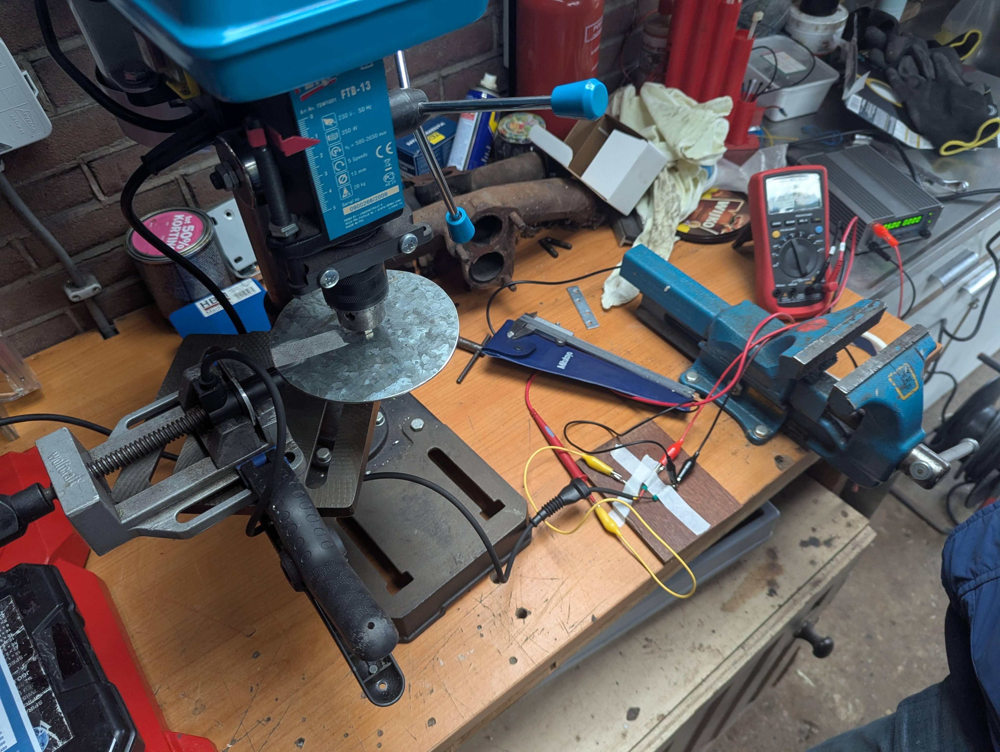
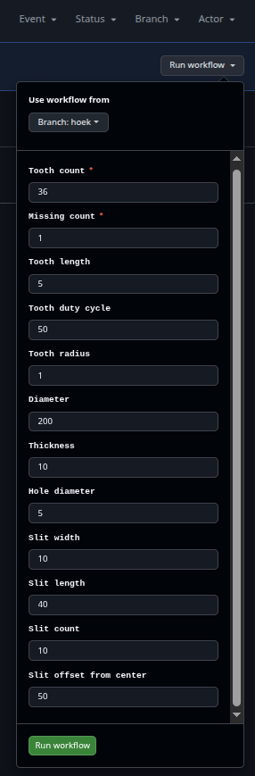
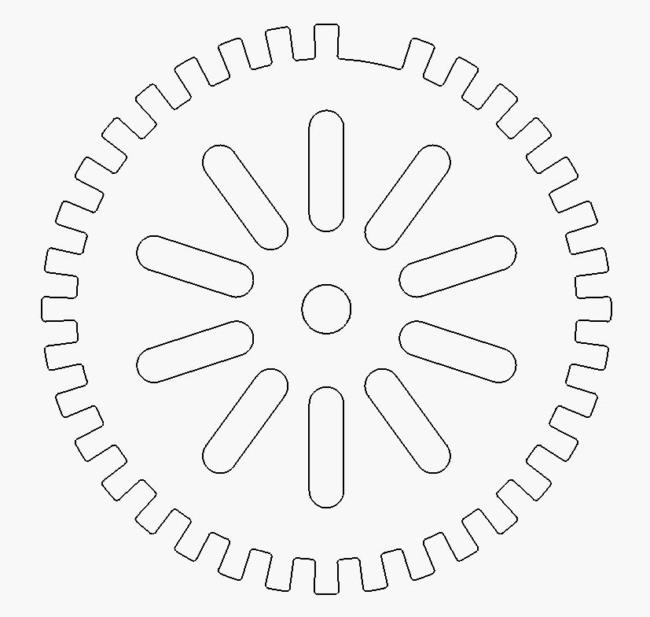
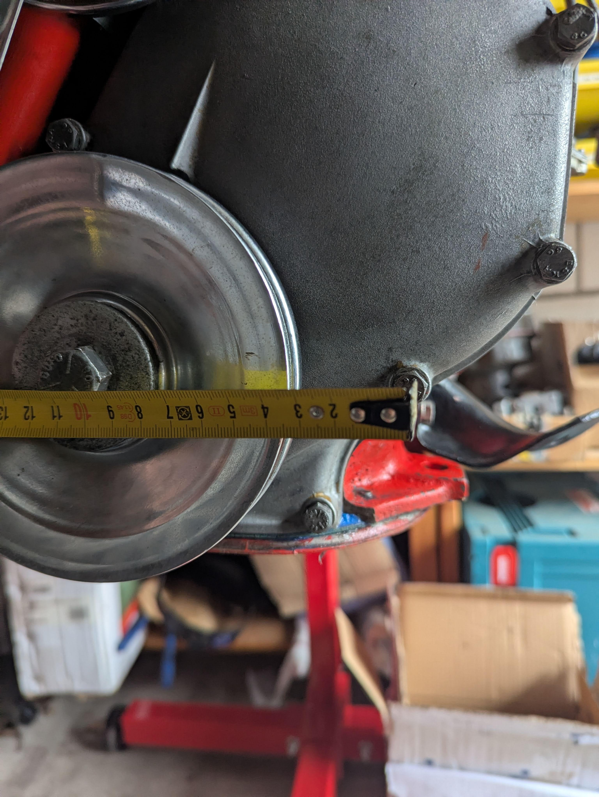
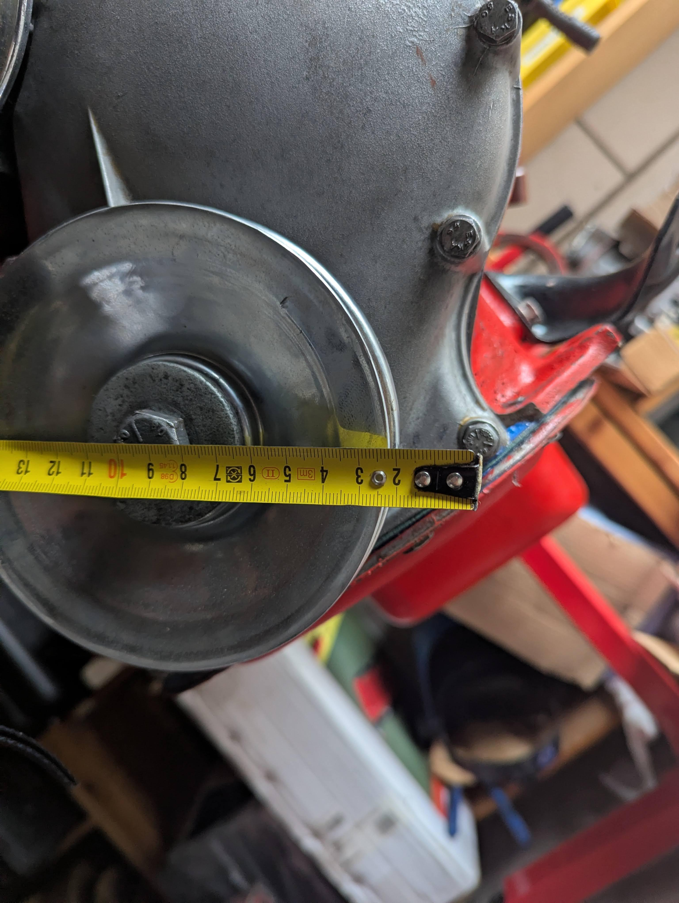
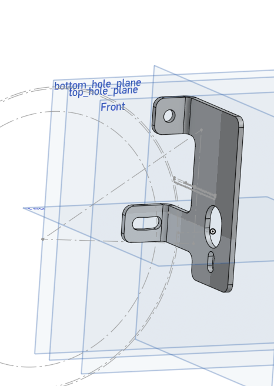
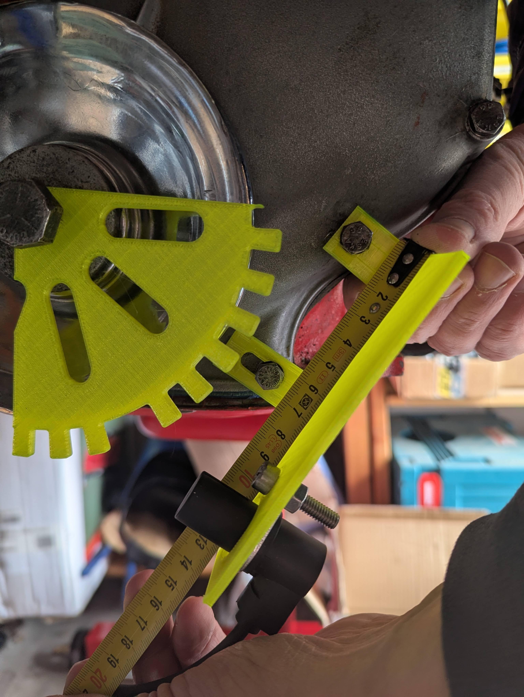

# Crank angle sensor (CAS)

## Sensor

The crank angle sensor is one of the required sensors. It detects the angle of the crankshaft, required for measuring the speed(RPM) and determining the timing of the ignition modules.

I chose to go with a Hall effect sensor as it seems better than an 'analog' VR sensor. I chose to go with the ['BMW' 12141703277](https://nl.aliexpress.com/item/1005005095871568.html) as it is intended for engines and is easily mountable.

I'll just cut off the connector off the sensor, don't bother finding correct one after the other fails.

Tested it on a 3mm steel plate with a 5x5mm tooth filed in to it on the drill press and it works:

Used it with a 5V powersupply, put the drill-press on lowest setting and put the sensor a few mm from the widest point (plate was egg-shaped). Put the multimeter on Hz mode and it measured 2x the supposed RPM of the drill (/60 for Hz).

Then turned off the drill-press and twisted the plate by hand, only the tooth part and it measured it as well.

## Trigger wheel
To make a trigger plate, I used FreeCAD to make a drawing of a triggerwheel, and then over-engineered it by making it parametric and then creating an GitHub action for anyone to easily 'draw' their own.

You can download it here: [ArendJan/triggerWheel](https://github.com/ArendJan/triggerWheel)

You'll need FreeCAD 1.0.2 or higher and quite some time if you edit the parameters. I've set it to a 10-1 wheel, otherwise it'll take 10s+ to recompute. 

If you fork the repo and go to actions (might need to enable it) and click on the 'dxf export workflow' action -> 'run action button', you'll get this settings dropdown:

- Tooth count: amount of original teeth on the trigger wheel
- Missing count: amount of removed teeth
- Tooth length: how long are the teeth, sticking out from the 'normal' diameter of the wheel
- Tooth duty cycle: percentage of tooth vs gap
- Tooth radius: rounding edge of the tooth
- Diameter: 'normal'/inner diameter of the wheel (without the tooth)
- Thickness: thickness of the plate (not that necesary)
- Hole diameter: middle hole size for mounting or weight savings
- Slits: removal of extra mass that can just be removed
    - width: width of the slit
    - lengh: length of the slit (radius-like)
    - count: how many (needs to be 2+ for balancing)
    - offset from center: where to position them (radius-like)

I'm currently planning on using these values:
- tooth_count: 36
- missing_count: 1
- tooth_length: 10
- tooth_duty_cycle: 50
- tooth_radius: 1
- diameter: 145
- thickness: 5
- hole_diameter: 14.14 # TODO: a bit bigger as the bolt has an collar
- slit_width: 10
- slit_depth: 25
- slit_count: 10
- slit_offset: 40

This results in the following wheel:

It doesn't have a hole for balancing as it was a bit too difficult to figure it out and probably doesn't matter on my engine. I'll have it lasercut out of 3mm(or 5mm, if available) steel.

## Volvo pulley
The pulley on a B20 (and B18) has a diameter of 140mm, and a 9/16"UNF x 45mm bolt (#940111). The bolt has a collar of XXXXmm. The ring (#191688) holding the pulley on the crankshaft is 50mm (diameter) and 6mm thick. The edge of the pulley is 3mm higher than the ring. The bolt uses 15mm of the thread into the shaft. (TODO: check if this is before or after adding an extra 3mm ring and the 3 or 5mm plate).

## Sensor positioning
To position the sensor, I measured the two closest bolts on the timing gear cover. The measurements:
- top hole (used caliper for it):
    
    - horizontal from pulley edge: 38.8mm
    - from pulley front: 32.32mm
- bottom hole (also used caliper for it):
    
    - from pulley edge: 23.4mm
    - from pulley front: 50mm
- hole distance (pulley plane): 62.4mm

Sensor measurements:
- sensor hole: 18mm dia
- mounting hole dia: 6.5mm
- mounting hole to sensor hole: 19.25mm
- sensor length from mounting plate: 24mm
- wheel gap: 2mm

The trigger wheel will be 165mm in diameter (145 dia+2x10mm tooth)

I then drew this mounting plate: 

First attempt I mixed up a measurement and it was incorrect, but bolt pattern was correct:

I also flipped the sensor to not have the cable hanging on the ground.

You can see and edit it on [Onshape](https://cad.onshape.com/documents/014ff45bea66aa0bcdc0c0be/w/65de59ecee7c677c08520d6a/e/b62775a8e7906aeec321b7e0?renderMode=0&uiState=69a605904ff991894ba91dd2).