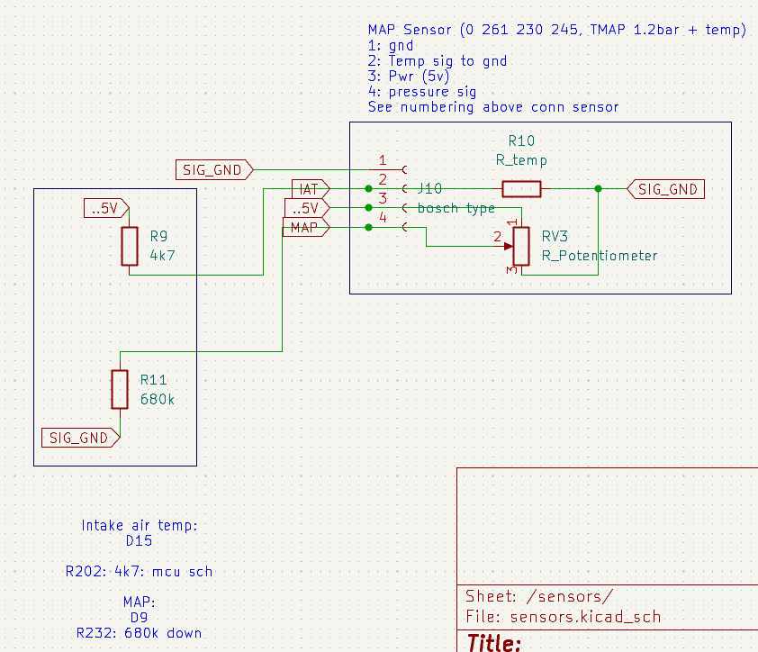

# MAP sensor

The throttle body adapter has a mount for the T-MAP sensor. 

TODO: photo

It's the [Bosch 0 261 230 022 sensor](https://www.bosch-motorsport-shop.com.au/t-map-sensor-1.15-bar-125-deg-c), 0.1-1.15 bar, 125deg c.

Connector [4 Pin Sensor Female Wire Connector MAP Ford Falcon for XR6 TMAP 1928403736](https://nl.aliexpress.com/item/1005005329929076.html).

The hole in the adapter is a bit too big, so needs to be glued in probably.

The connector doesn't have enough room to be taken on/off, adapter needs to be a bit longer, but for now I'll need to remove the complete sensor to disconnect it.

