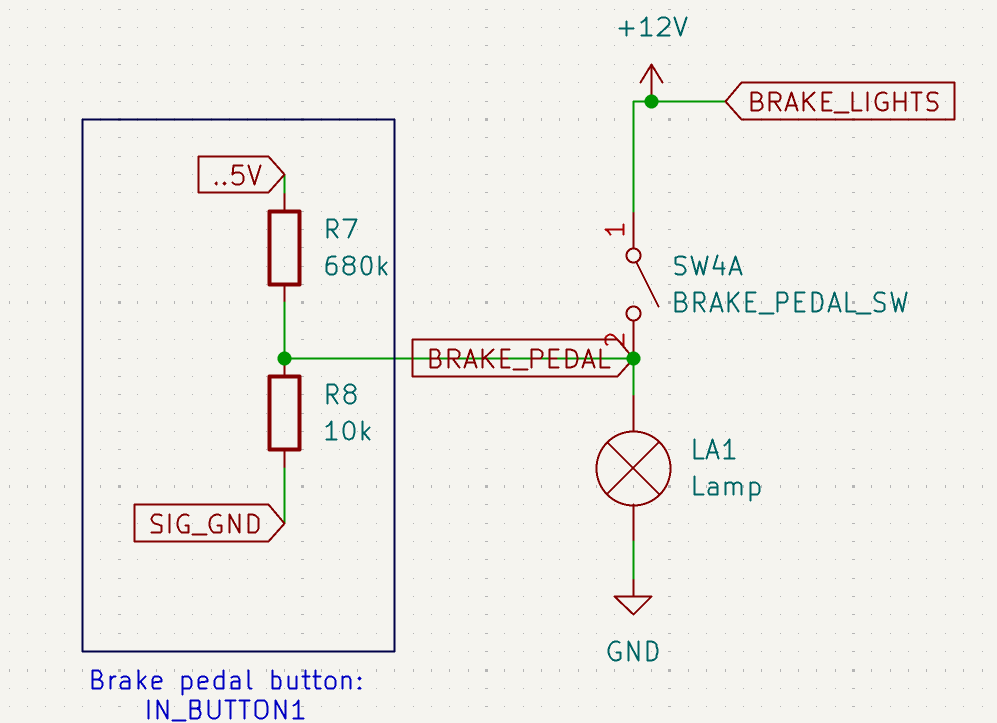
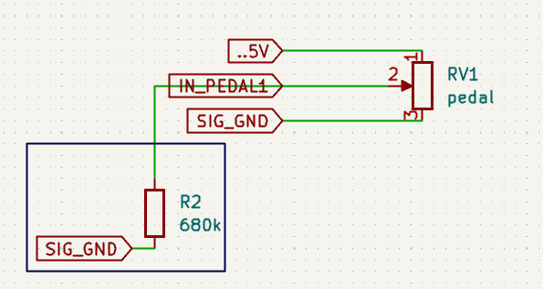
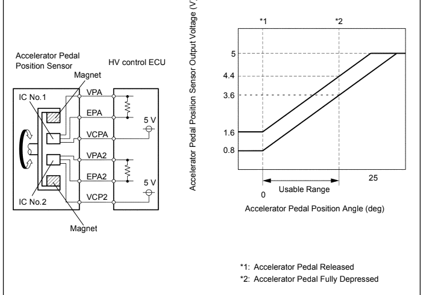

# Pedals

## Brake pedal

One safety requirement of myself is to press the brake pedal while cranking. I've mounted a normally open switch on the pedal ages ago that is depressed (on) when the pedal is pressed a bit. This switch is much safer than the original hydraulic switch as it reacts much faster.

Schematic, unsure about resistor values:

Due to the lights (led in my case), the signal is pulled down when not pressed and connected to 12V when the brake is pressed.

## Gas pedal

Due to earlier experience (electric Volvo 245) with it, I ordered a Prius gas pedal ( 7812047050 ) from www.onderdelenlijn.nl. 

I used [6 Pin Auto waterproof Connector Accelerator Pedal TPS Throttle Sensor Wire harness plug 7283-1968-30 90980-11858 For Toyota](https://nl.aliexpress.com/item/1005008268326334.html) (female) to connect to it.

I'll need to calibrate my ECU when I mount it.

Pedal 2 is the same as pedal 1 signal, but it should either be inverse or should have enough offset between the signals

Pinout and offset of the prius pedal:

First test:

<video controls src="../../actuators/throttle_body/images/first_dbw_mess.mp4" title="first dbw test"></video>

